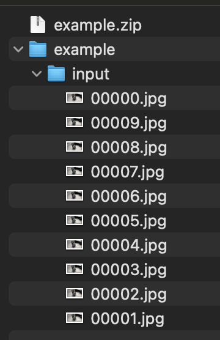
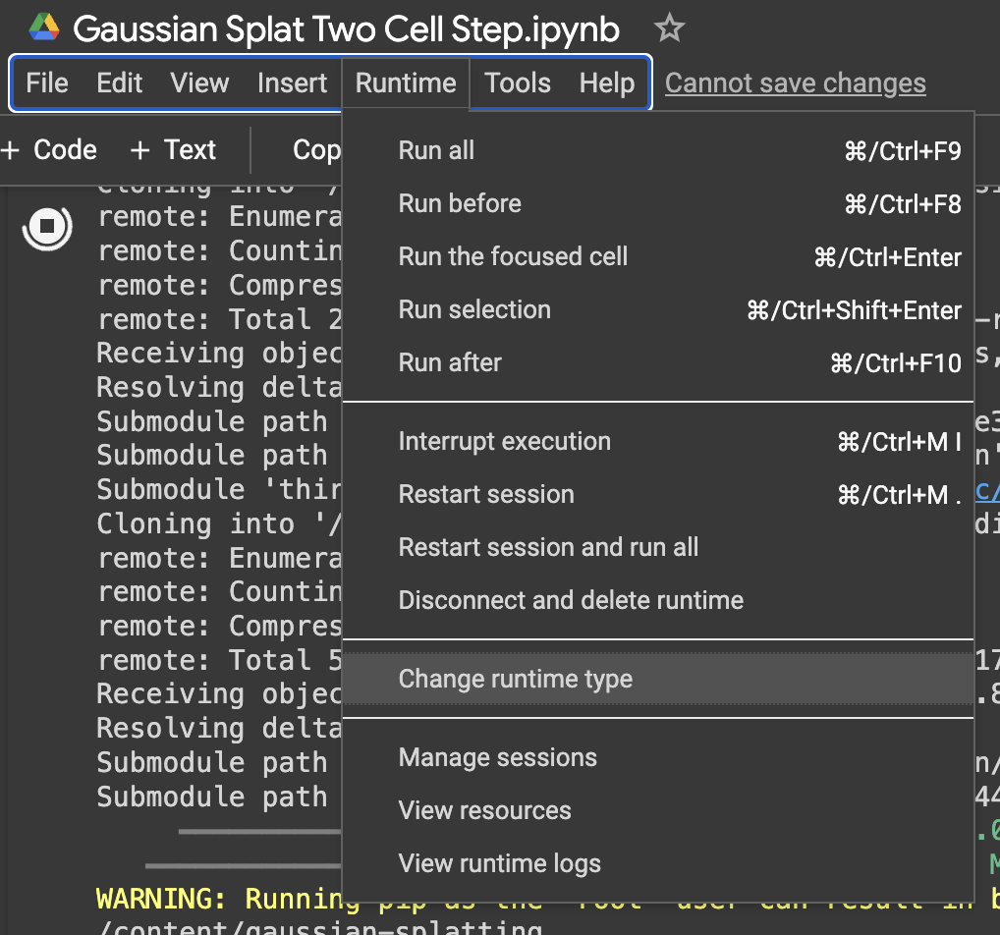
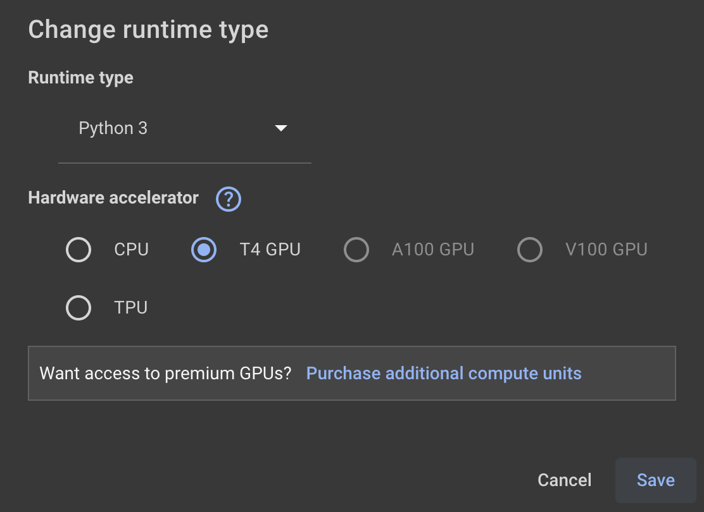
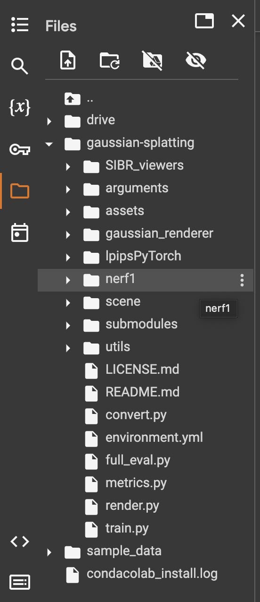
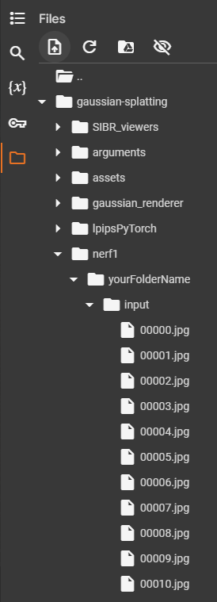
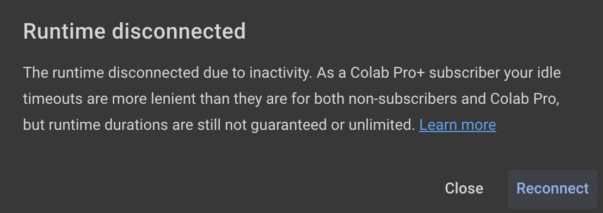
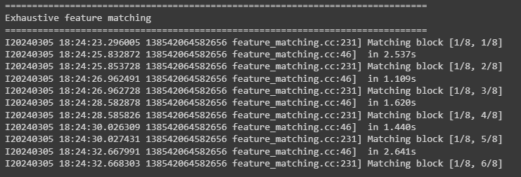

# Gaussian Splatting Guide
A guide on how to create Gaussian Splats for real-time applications 

Special thanks to my supervisor Hongchuan Yu 


## Gaussian Splatting Introduction 
Gaussian Splatting has emerged as a revolutionary technique in the realm of computer graphics, particularly enhancing mixed and virtual reality experiences with its ability to render highly detailed, immersive environments. Originating as a revitalized method for real-time rendering presented at Siggraph 2023, Gaussian Splatting has significantly shifted the paradigm of 3D data visualization.

This method diverges from traditional rasterization techniques, which construct scenes using an extensive network of vertices and faces. Instead, Gaussian Splatting utilizes mathematical functions to depict 3D objects and scenes, offering a novel approach to representing complex geometries. The integration of machine learning further refines this process, enabling algorithms to fine-tune Gaussian representations. This optimization not only enhances detail and realism but also minimizes rendering times, offering a substantial improvement over conventional techniques.

Particularly advantageous for rendering environments rich in complex 3D geometry, Gaussian Splatting excels in scenarios where surfaces are far from smooth or flat. Its capability to elevate visual fidelity makes it a pivotal development for VR and AR applications, including games that demand high levels of detail. Beyond entertainment, the technology holds significant potential for preserving cultural and historical sites, enabling precise capture and virtual representation of intricate structural details.

Furthermore, Gaussian Splatting's application extends to educational and training programs, such as simulating realistic scenarios for firefighters, thereby providing a safe virtual platform for practical learning. The future of this technology promises even broader applications, including the dynamic rendering of moving entities like animals and humans with unprecedented detail, surpassing the capabilities of older digital creature representation methods.

As the demand for highly detailed virtual environments continues to grow, spanning from real estate marketing to historical preservation, Gaussian Splatting stands as a transformative technology. Its ability to render complex scenes efficiently without sacrificing detail or realism opens new avenues for exploration and interaction within virtual and mixed realities.


## Guide to creating your own Gaussian Splats

## &nbsp;1.	Image Acquisition
To generate a Gaussian Splat from captured imagery, follow these easy steps:

*   **Step 1: Image Acquisition**
    
    *   Start by capturing a series of images of your subject. Aim for a wide range of angles to get a comprehensive view.
*   **Step 2: Recording Technique**
    
    *   Ideally, record a continuous video while walking around the subject. Keep your pace steady and even to ensure consistent angles throughout the scene.
*   **Step 3: Focus on Details**
    
    *   Pay special attention to the undersides of objects, which are often missed at standard viewing heights.
*   **Step 4: Control Motion Blur**
    
    *   Maintain a moderate pace while recording to avoid motion blur, which could compromise the accuracy of your Gaussian Splat.
*   **Step 5: Ensure Consistency**
    
    *   To ensure uniformity across all frames, fix your camera settings before starting. This includes the exposure, aperture, ISO, and focal length settings to avoid visual inconsistencies in the final product.
    *   Ensure you do not use a too wide angled lens as the algorithm sometimes has trouble processing this into Gaussian splats
 

## 2.	Image Extraction and Preparation
To ensure your images are correctly formatted for the Gaussian Splatting process, follow these detailed steps:

*   **Step 1: Video Recording**
    
    *   Use a smartphone to capture the video of your subject. This video will later be converted into a series of images.
*   **Step 2: Transfer Footage**
    
    *   Connect your smartphone to your computer using a USB cable. Allow data access between your phone and computer to transfer the video footage.
*   **Step 3: Editing Software**
    
    *   Import the video into an editing software, such as Adobe Premiere Pro, for processing.
*   **Step 4: Adjust Export Settings**
    
    *   In Premiere Pro, set the export resolution to 980x545 pixels, which is optimal for the Gaussian Splatting process.
    *   Make sure the image format says .jpg
*   **Step 5: Naming Convention**
    
    *   Establish a precise naming system for your images. Start with “00001” and increase sequentially, making sure each name consists of 5 digits to maintain order.
*   **Step 6: Determine Image Quantity**
    
    *   The total number of images affects the model training time. Aim for about 500 images for efficient processing.
*   **Step 7: Export Images**
    
    *   Adjust your video's playback speed to match the desired number of frames (images). For instance, to obtain 500 images, you could slow your footage down to 20 seconds and export at a frame rate of 25 frames per second (fps) in JPEG format.
    *   Total Images = Video Length * Frames Per Second
*   **Step 8: Organize Dataset**
    
    *   Arrange your images within a structured file system. Inside a directory with a relevant name, create a subdirectory named ‘input’.
    *   You must have a subfolder inside your original folder named "input" and inside input are your images
    *   The file structure should look like this
    *   
*   **Step 9: Compress for Transfer**
    
    *   Compress the folder containing your organized images into a zip archive to facilitate easier transfer and processing later on.
## 3.	Model Training
**IMPORTANT** - If you google colab session is disrupted and disconnects your files may be removed, for best results open colab on desktop wired computer with constant stable internet connection
*   You may also find you hit  GPU usage limit if you use the GPU for too long
*   **Step 1: Open Colab Page**
    * Next click this [](https://colab.research.google.com/drive/1S_zyDlc_qfJKIGtwBCiP1MSOE5aNQ71H?usp=sharing) button.
    * Press 'copy to drive' at the top
    * Rename you google colab notebook to something of your choosing.
    * (If you have a paid colab account that allows for better GPU, you should change to T4 or the other GPU now)
*  **Step 2: Change to GPU**
    * Press "Runtime" ->  "change runtime type" and then select "T4 GPU"
    * **IMPORTANT** If you do not select the GPU here the CUDA will not be able to install
    * (If you have the paid version of google colab you can change the runtime type to "A100 GPU")
    * 
    

*   **Step 3: Run Install Cell**
    * Next you'll see a bigger code cell just below it titled "INSTALL CELL"
    * Run that cell by pressing the play button next to it
    * Wait for the cell to finish running before moving on to the next step
    * ( May take 5 - 15 minutes )
*   **Step 4: Upload Zip**
    * In the left panel click the folder icon to refresh the folder viewer
    * Then locate the /content/gaussian-splatting/nerf1 folder
    * Drag your zip file from your local computer file explorer into the folder titled "nerf1"
    
    <br>
    IMPORTANT NOTE! - You won't see this folder until after you run the "Install Cell"  and you refresh the folder viewer by pressing the icon with the folder and the refresh arrow
    <br>
    
*   **Step 5: Change Zip Name**
    * After clicking the Colab link you'll see a code cell that has this line at the top of it.
    * Change 'chairScene.zip' to point to the name of your zip
    * And then run the cell by pressing the play button next to it
   ```
zip_file_name = 'youZipNameHere.zip'  # Name of the zip file
   ```
* **IMPORTANT!** You will have errors unzipping the zip if you do not wait for the zip file to finish uploading, please wait for the blue progress circle to complete before moving on to the next stage.
* 
*    Check your file structure looks like this on your colab file viewer
*    

*  **Step 6: Run Training Code**
    * Finally run the last cell titled "#GENERATE CELL" to start generating your Gaussian splat
    * **IMPORTANT!** You may have to regularly click anywhere on the notebook page to stop the session from disconnecting due to inactivity
    * 
*  **Step 7: Check it's working correctly**
*  If it says "Exhaustive feature matching" that means it is currently doing the feature matching
*  
*  If while running you see a lot of lines that say "Termination : No convergence" then that might be an indication something has gone wrong, and it is suggested you start again checking you completed the steps above carefully
*  
*  If it says "Termination : convergence" mostly then that is good.
*  
*  During the training process you will see a line at the bottom that says "Training Progress: 1% 430/30000..." this will give you an indication of how much of the training process is left
*  The training is completed when it says "100%" and says 30000/30000, however at 23% and 7000/30000 it will save a lower quality quick version that you can download and check
*  
*  **Step 8: Download Point Cloud**
    * Find and download the point cloud to your computer from /content/gaussian-splatting/nerf1/output/502acfe6-5/point_cloud/iteration_30000/point_cloud.ply
    * Right-click the three dots next to it and click download
    * Take note it may take a while for it to download and the blue progress circle to complete
    * It is also suggested that you change the name of the "point_cloud.ply" as soon as it is downloaded to avoid confusion later on 
    * View and edit it using [Gaussian Splatting Editor](https://playcanvas.com/supersplat/editor)
    * Or view it using [Gaussian Splatting Viewer](https://antimatter15.com/splat/) and by dragging and dropping the point cloud into the webpage viewer
 


## Demo Video of Results
[Watch on YouTube]("https://youtu.be/jjLMmTkjSHk?si=6JiZsKZV7QIY5a5o") <br>
<br>
[](https://youtu.be/jjLMmTkjSHk?si=6JiZsKZV7QIY5a5o)


scene credit: Bournemouth University Poole Gateway Desk [Bournemouth University NCCA](https://www.bournemouth.ac.uk/)

## About 
Guide based on the tool made by cclaan
- [Original Gaussian Splatting Tool by cclaan](https://github.com/laanlabs/metal-splats)
- [Original Gaussian Splatting Repo](https://github.com/graphdeco-inria/gaussian-splatting/)
- [Unity Gaussian Splatting](https://github.com/aras-p/UnityGaussianSplatting)
- [WebGL Gaussian Splats](https://github.com/antimatter15/splat)
- [WebGPU Gaussian Splatting from cvlab-epfl](https://github.com/cvlab-epfl/gaussian-splatting-web) 
- [MrNeRF gaussian splatting cuda](https://github.com/MrNeRF/gaussian-splatting-cuda)


Uses [Satin + Forge](https://github.com/Hi-Rez/Satin) for AR + 3d viewer ( by [@rezaali](https://twitter.com/RezaAli) )
 


## License(s)
Parts of the code are based on the original Gaussian-Splatting software and is governed by the [Gaussian-Splatting License](https://github.com/graphdeco-inria/gaussian-splatting/blob/main/LICENSE.md), which can be found in the [LICENSE]() file in this repository. The original software was developed by Inria and MPII.

Please be advised that the software in this repository cannot be used for commercial purposes without explicit consent from the original licensors, Inria and MPII.

[Satin + Forge](https://github.com/Hi-Rez/Satin) are released under the MIT license. See [LICENSE](https://github.com/Hi-Rez/Satin/blob/master/LICENSE) for details. 
